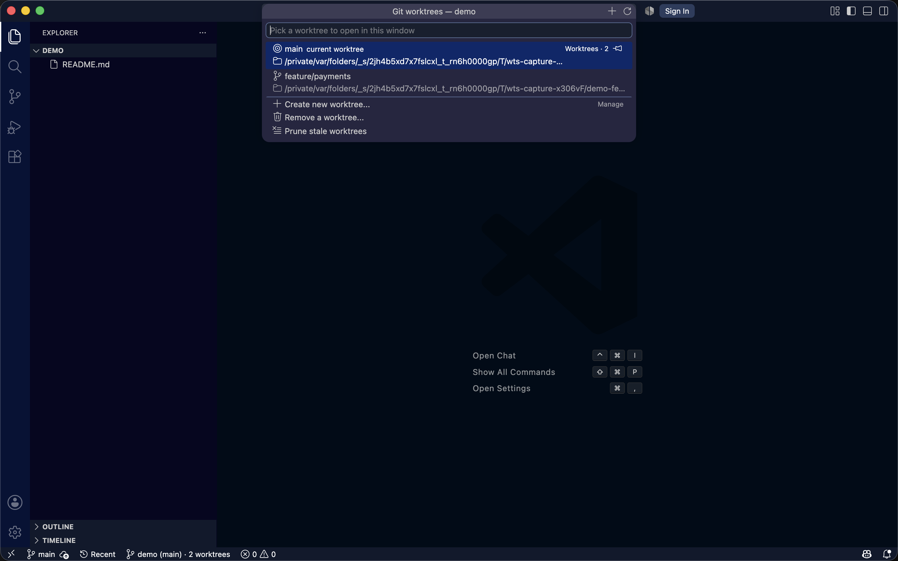

# Git Worktree Switcher

A status bar worktree switcher for VS Code, the feature Zed gives you out of the box.

The status bar shows the branch of your current worktree. Click it to open a picker of
every worktree in the repository. Choosing one **reopens it in the current window** — no
new window unless you ask for it.

## Features

- **See your branch at a glance.** The status bar shows the branch of your current
  worktree, for example `⧉ wt: feature/checkout`. You can change the text with
  `worktreeSwitcher.statusBarFormat`.
- **Switch worktrees in one click.** Click the status bar item, or press
  `Ctrl+Alt+W` (`Cmd+Alt+W` on macOS), to open a picker of every worktree in the
  repository.
- **See status before you switch.** Each worktree row shows its branch, folder path,
  how many files changed, and how far it is ahead or behind its remote. This loads in
  the background, so the picker opens instantly.
- **Jump to a recent folder too.** A separate action opens a list of folders you had
  open recently. Folders that are worktrees of the current repository are left out —
  they already have a home in the worktree picker.
- **Pin what you use most.** Click the pin button on any worktree or recent-folder row
  to keep it at the top of its picker. Worktree pins are saved per repository; recent-folder
  pins are saved globally, and the two never affect each other.
- **Jump straight to a worktree with the keyboard.** `Ctrl+Shift+1`…`5` (`Cmd+Shift+1`…`5`
  on macOS) open the 1st through 5th row of the worktree picker (pinned rows first). Every
  slot from 1 to 9 exists as a command even if only 1-5 have a default key — rebind or add
  more from `keybindings.json` like any other VS Code shortcut.
- **Stay in the same window.** Everything opens in your current window by default.
  Click the ⧉ button on a row to open it in a new window instead.
- **Create a worktree in a few clicks**, from a local branch, a remote branch, or a
  brand new branch.
- **Remove or clean up worktrees safely.** Remove one (with a force option if it has
  changes), or prune every stale worktree at once.
- **Notice when you are in a detached state.** The status bar turns orange when the
  current worktree has no branch checked out.
- **Always up to date.** The status bar refreshes automatically on branch change,
  window focus, and editor change.

## Screenshots

**Recent folders picker** — the status bar chip shows the active worktree branch at a
glance.


**Worktree picker** — pick any worktree in the repository, with dirty and clean status
shown per row.



A short demo video is available on the author's YouTube channel:
[Code Career Golpo](https://www.youtube.com/@codecareergolpo5638).

## Commands


| Command                            | Default keybinding         |
| ---------------------------------- | -------------------------- |
| `Worktree: Switch...`              | `Ctrl+Alt+W` / `Cmd+Alt+W` |
| `Worktree: Open Recent Folder...`  | —                          |
| `Worktree: Create New Worktree...` | —                          |
| `Worktree: Remove Worktree...`     | —                          |
| `Worktree: Refresh Status Bar`     | —                          |
| `Worktree: Switch to Slot 1`       | `Ctrl+Shift+1` / `Cmd+Shift+1` |
| `Worktree: Switch to Slot 2`       | `Ctrl+Shift+2` / `Cmd+Shift+2` |
| `Worktree: Switch to Slot 3`       | `Ctrl+Shift+3` / `Cmd+Shift+3` |
| `Worktree: Switch to Slot 4`       | `Ctrl+Shift+4` / `Cmd+Shift+4` |
| `Worktree: Switch to Slot 5`       | `Ctrl+Shift+5` / `Cmd+Shift+5` |
| `Worktree: Switch to Slot 6` … `9` | — (no default; rebind yourself if you need more than 5) |

Slot commands open the worktree at that position in the picker's pinned-then-recency
order — slot 1 is the first row you would see, slot 2 the second, and so on. All of
these are **default** bindings, not fixed ones: rebind or disable any of them from
`keybindings.json` if they clash with something else on your machine.


## Settings


| Setting                                 | Default                      | What it does                                                                    |
| --------------------------------------- | ---------------------------- | ------------------------------------------------------------------------------- |
| `worktreeSwitcher.openInNewWindow`      | `false`                      | Always open the chosen worktree in a new window.                                |
| `worktreeSwitcher.statusBarAlignment`   | `left`                       | Place the status bar item on the `left` or `right` side.                        |
| `worktreeSwitcher.statusBarPriority`    | `100`                        | Higher value moves the item further left.                                       |
| `worktreeSwitcher.statusBarFormat`      | `$(git-branch) ${folder} (${branch}) · ${count} worktrees` | Label template. Variables: `${branch}`, `${folder}`, `${count}`, `${detached}`. |
| `worktreeSwitcher.showWorktreeStatus`   | `true`                       | Show dirty count and ahead/behind counts per worktree in the picker.            |
| `worktreeSwitcher.newWorktreeParentDir` | `""`                         | Default parent folder for new worktrees.                                        |


## How to use it

1. Open a Git repository that has one or more worktrees.
2. Look at the status bar. It shows the branch of the current worktree.
3. Select the status bar item, or press `Ctrl+Alt+W` (`Cmd+Alt+W` on macOS).
4. Select a worktree from the picker. VS Code reopens the current window in that worktree.
5. To open a worktree in a new window instead, select the ⧉ button next to its row.
6. To create, remove, or prune worktrees, use the **Manage** section of the same picker.

## Develop

```bash
npm install
npm run compile
# then press F5 in VS Code to launch an Extension Development Host
npm run package     # requires: npm i -g @vscode/vsce
```

## Notes

- Switching runs `vscode.openFolder`, so the current window reloads. VS Code's hot exit
restores unsaved editors, but a reload is still a reload.
- If the window has a multi-root `.code-workspace` open, switching replaces it with the
single worktree folder.
- The extension detects the repository from the workspace folder that owns the active
editor. If no editor is active, it falls back to the first workspace folder.

## Feedback and issues

If you find a bug, or you want to request a feature, please open an issue on GitHub:

👉 [Open an issue](https://github.com/Sumonta056/worktree-switcher-vscode/issues)

Your feedback helps improve this extension for everyone.

## About the author

**Sumonta Saha Mridul** — Associate Software Engineer.

- GitHub: [github.com/sumonta056](https://github.com/sumonta056)
- LinkedIn: [linkedin.com/in/sumonta-saha-mridul-b35bb61a0](https://www.linkedin.com/in/sumonta-saha-mridul-b35bb61a0/)
- YouTube: [Code Career Golpo](https://www.youtube.com/@codecareergolpo5638)

---

*This project and its documentation were built through a collaboration between AI and a
human — "AI + U".*